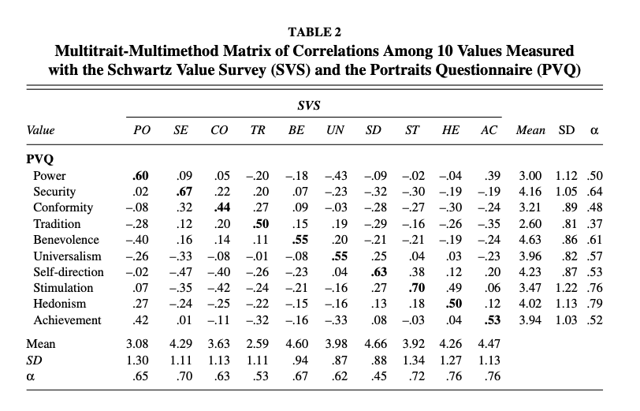
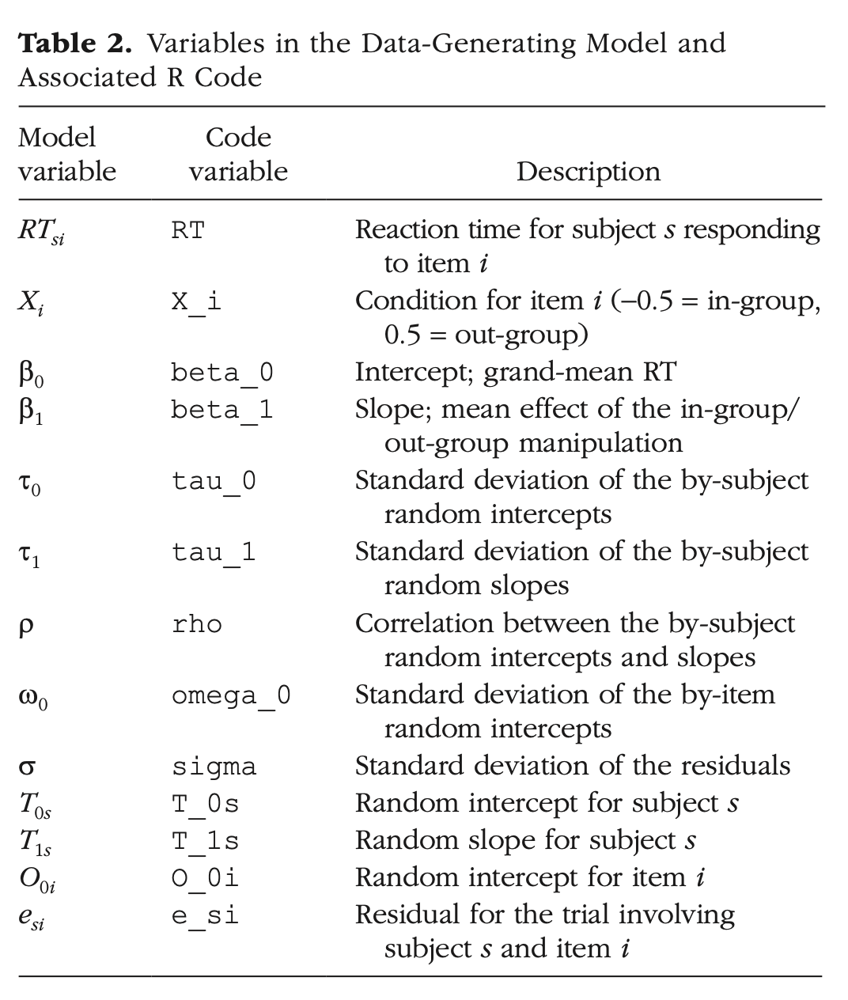

# Summary

This file is the documentation of the disassembled pieces of the 'big' data simulation function. 

The aim is to simulate:
- multi-dimensional 'ground' truth, using an existing correlation matrix

- random effects of respondents to a survey
- respondent observations, comprised of respondent random effects and ground truth

```{r, message=FALSE}
library("faux")        # simulation of multivariate data
library("stringr")     # to create alphanumeric IDs
library("data.table")  # data manipulation

# ensure this script returns the same results on each run
set.seed(42) #the answer to life, the universe, and everything
```

## Source material:

Correlation matrix taken from SVS correlations (upper triangle) in the appendix:

Means and standard deviations retrieved from this table:

I follow variable naming conventions from this tutorial: 


The defaults are extracted from the above cited papers:

```{r}
  #defaults:
  value_names = c('power', 'security', 'conformity', 'tradition', 'benevolence', 'universalism', 'self_direction', 'stimulation', 'hedonism', 'achievement')
  
  #correlation matrix to be used for simulation. 
  #as the default, we use the correlation matrix from Schwartz, 2001:
  correlation_matrix = rbind(
  c(   1,  .04, -.04, -.20, -.32, -.48,  -.11,  .01,  .09,   .50), #power
  c( .04,    1,  .25,  .08,  .01, -.30,  -.34, -.35, -.12,  -.11), #security
  c(-.04,  .25,    1,  .35,  .15, -.19,  -.41, -.31, -.32,  -.18), #conformity
  c(-.20,  .08,  .35,    1,  .12, -.07,  -.31, -.19, -.42,  -.38), #tradition
  c(-.32,  .01,  .15,  .12,    1, -.08,  -.20, -.25, -.26,  -.25), #benevolence
  c(-.48, -.30, -.19, -.07, -.08,    1,   .12, -.02, -.01,  -.39), #universalism
  c(-.11, -.34, -.41, -.31, -.20,  .12,     1,  .22,  .19,   .13), #self-direction
  c( .01, -.35, -.31, -.19, -.25, -.02,   .22,    1,  .29,   .02), #stimulation
  c( .09, -.12, -.32, -.42, -.26, -.01,   .19,  .29,    1,   .12), #hedonism
  c( .50, -.11, -.18, -.38, -.25, -.39,   .13,  .02,  .12,     1)) #achievement
  
  n_subj      = 50                 # number of subjects
  n_items     = 50                 # number of stimuli
  n_ratings   = 5                  # number of stimuli rated by participants
  n_machines  = 8                  # number of machine setups
  n_trials    = 10                 # number of trials per machine setup
  mu          = rep(0, 10)         # ground truth means per value, centered at 0
  SD          = c(1.3, 1.11, 1.13, 1.11, .94, .87, .88, 1.34, 1.27, 1.13)
  tau_0       = 4                  # by-subject random intercept sd
  tau_1       = rnorm(10, 0, 3)    # by-subject random slope sd per value
  tau_0_m     = 2                  # by-machine random intercept sd
  tau_1_m     = rnorm(10, 0, 3)    # by-machine random slope sd per value
  tau_2_m     = rnorm(n_trials, 0, 0.1) # by-(trial|machine) intercept sd
  e_sd        = 1                  # residual error
  
  rho_s = cbind(c(1,rep(0.00,10)), rbind(0.00, correlation_matrix))
  rho_m = cbind(c(1,rep(0.00,10)), rbind(0.00, correlation_matrix))
```

### Simulate Item Ground Truth 

```{r}
#item simulation function
item_ground_truth_sim_function <- function(n_items, mu, SD, correlation_matrix, value_names){
  
  #simulate 'ground truth' for set of items to be judged by participants
  item_ground_truth <- faux::rnorm_multi(
  n = n_items, 
  mu = mu, 
  sd = SD,
  r = correlation_matrix,
  varnames = value_names)
  
  #convert to a data frame, add titles, and item identification numbers
  setDT(item_ground_truth)
  item_ground_truth[, item_ID := paste0("2", str_pad(seq(1:.N), 6, pad='0'))]
}

#item_ground_truth <- item_ground_truth_sim_function(n_items, mu, SD, correlation_matrix, value_names)
```

### Simulate Participant Observations

```{r}
#subject simulation function
subject_sim_function <- function(n_subj, n_ratings, tau_0, tau_1, rho_s, e_sd, item_ground_truth){
  
  ### subjects ###
  #simulate random effects for subjects
  subject_random_effects <- faux::rnorm_multi(
  n = n_subj, 
  mu = 0, 
  sd = c(tau_0, tau_1),
  r = rho_s,
  varnames = c("T_0s", "T_1s", "T_2s", "T_3s", "T_4s", "T_5s", "T_6s", "T_7s", "T_8s", "T_9s", "T_10s"))
  
  #convert to data table
  setDT(subject_random_effects)
  
  #create participant identification numbers
  subject_random_effects[, subject_ID :=  paste0("1", str_pad(seq(1:.N), 4, pad='0'))]
                          
  #create a large data frame where each subject encounters each item
  subject_trials <- setkey(item_ground_truth[,c(k=1,.SD)],k)[subject_random_effects[,c(k=1,.SD)],allow.cartesian=TRUE][,k:=NULL]
 
  #subset by number of observations
  subject_trials <- subject_trials[, .SD[sample(.N, ..n_ratings)], by = subject_ID]  
  
   #add random error to each observation
  subject_trials <-  subject_trials[, e_si := rnorm(nrow(subject_trials), mean=0, sd=e_sd)][, .(
    #create simulated observed values by adding random effects to ground truth
    subject_ID = subject_ID,
    item_ID = item_ID,
    y_power = power + T_0s + T_1s + e_si,
    y_security = security + T_0s + T_2s + e_si, 
    y_conformity = conformity + T_0s + T_3s + e_si,
    y_tradition = tradition + T_0s + T_4s + e_si,
    y_benevolence = benevolence + T_0s + T_5s + e_si,
    y_universalism = universalism +  T_0s + T_6s + e_si,
    y_self_direction = self_direction + T_0s + T_7s + e_si, 
    y_stimulation = stimulation + T_0s + T_8s + e_si, 
    y_hedonism = hedonism + T_0s + T_9s + e_si,
    y_achievement = achievement + T_0s + T_10s + e_si 
)] 
  
} 

# each individual line in this function works, but the function call fails:
#subject_trials <- subject_sim_function(n_subj, n_items, e_sd, rho_s, item_ground_truth=item_ground_truth)
```

## Overall Simulation Function:

```{r}
#good little subject function
my_sim_data <- function(
  
  #as per the Schwartz 2001 value inventory, there are 10 values:
  value_names = c('power', 'security', 'conformity', 'tradition', 'benevolence', 'universalism', 'self_direction', 'stimulation', 'hedonism', 'achievement'),
  
  # correlation matrix to be used for simulation. 
  # as the default, we use the correlation matrix from Schwartz, 2001:
  correlation_matrix = rbind(
  c(   1,  .04, -.04, -.20, -.32, -.48,  -.11,  .01,  .09,   .50), #power
  c( .04,    1,  .25,  .08,  .01, -.30,  -.34, -.35, -.12,  -.11), #security
  c(-.04,  .25,    1,  .35,  .15, -.19,  -.41, -.31, -.32,  -.18), #conformity
  c(-.20,  .08,  .35,    1,  .12, -.07,  -.31, -.19, -.42,  -.38), #tradition
  c(-.32,  .01,  .15,  .12,    1, -.08,  -.20, -.25, -.26,  -.25), #benevolence
  c(-.48, -.30, -.19, -.07, -.08,    1,   .12, -.02, -.01,  -.39), #universalism
  c(-.11, -.34, -.41, -.31, -.20,  .12,     1,  .22,  .19,   .13), #self-direction
  c( .01, -.35, -.31, -.19, -.25, -.02,   .22,    1,  .29,   .02), #stimulation
  c( .09, -.12, -.32, -.42, -.26, -.01,   .19,  .29,    1,   .12), #hedonism
  c( .50, -.11, -.18, -.38, -.25, -.39,   .13,  .02,  .12,     1)), #achievement
  
  n_items     = 50,                # number of stimuli
  mu          = rep(0, 10),        # ground truth means per value, centered at 0
  # SD: omega, SD per value, the random intercept per item from Schwartz, 2001:
  SD          = c(1.3, 1.11, 1.13, 1.11, .94, .87, .88, 1.34, 1.27, 1.13),

  n_subj      = 50,                # number of subjects
  n_ratings   = 5,                 # number of stimuli rated by participants
  tau_0       = 4,                 # by-subject random intercept sd
  tau_1       = rnorm(10, 0, 3),   # by-subject random slope sd per value

  # rho_s: correlation matrix of random slopes per participant:
  # we assume no correlation between subject intercept and slope
  # thus, we add a row and a column of 0, except for position (1,1) of the matrix.
  # we assume the correlations of the slopes resemble the original correlation matrix
  rho_s = cbind(c(1,rep(0.00,10)), rbind(0.00, correlation_matrix)), 
  
  e_sd  = 1         # residual (standard deviation)
)
{
  #simulate ground truth for the item responses
  item_ground_truth <- item_ground_truth_sim_function(n_items, mu, SD, correlation_matrix, value_names)
  
  #simulate participant responses to the items
  subject_trials <- subject_sim_function(n_subj, n_ratings, tau_0, tau_1, rho_s, e_sd, item_ground_truth)
}
```


```{r}
#sim_data <- my_sim_data(n_subj=50, n_ratings=5, tau_0 = 2)
```


