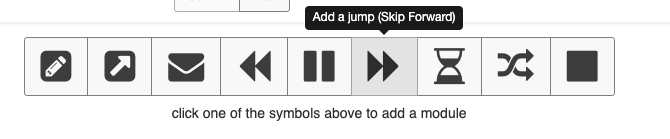
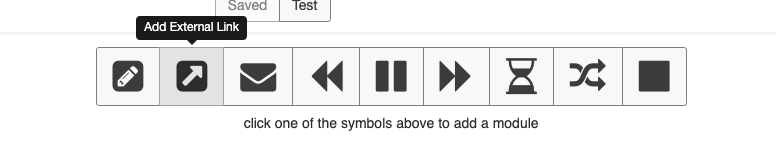
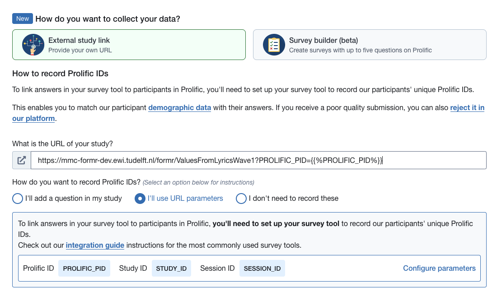
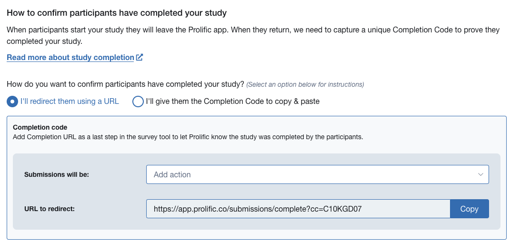
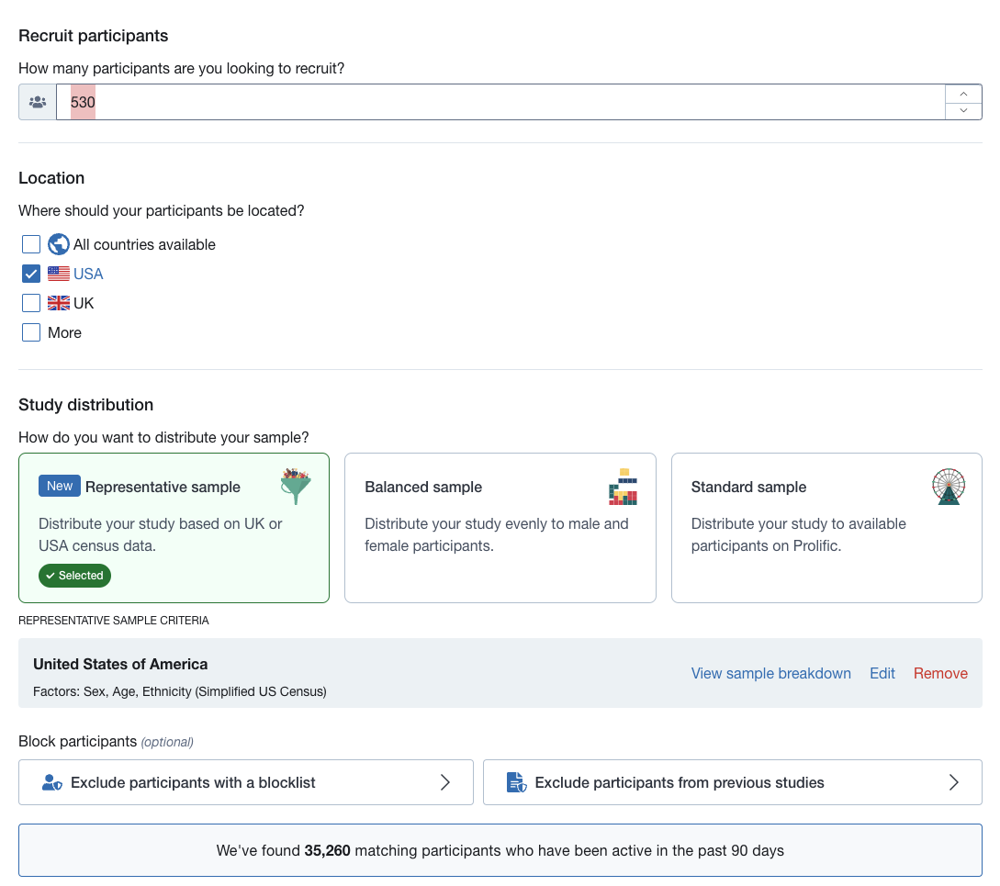
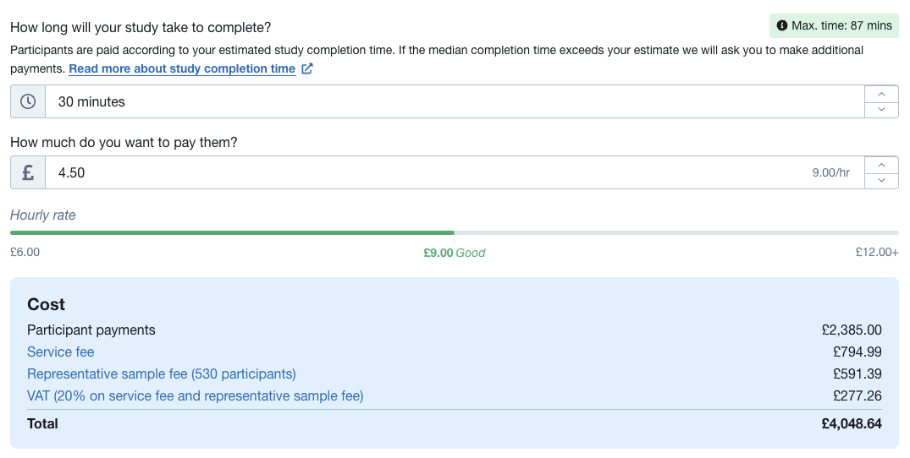

# AIM

This notebook documents the settings required to configure the data collection wave on on the formR survey platform, and the prolific.co participant recruitment platform.

## formR: configuring Runs

The formR survey platform gathers data in [Runs](https://formr.org/documentation/#run_module_explanations). Runs execute a number of nodes in a sequence and can be configured flexibly. What follows is the configuration for our runs.

Participants in each survey were randomly assigned 18 lyric stimuli to rate. Because the server had issues when our surveys included questions for more than 60 lyric stimuli, we separated the overall survey into 6 sub-surveys containing questions for 60 lyric stimuli each. These were identical, except for the specific lyric stimuli in each. Thus we aimed to randomly assign participants to one of the 6 surveys, which then randomly assigned 18 lyric stimuli per participant.

To accomplish this on the formR platform, we used the `shuffle` option on the bottom of the `Runs` screen:

We then set the number of groups on the `shuffle` node to 6:

*Note: the number we assigned to it (in this case the '1') determines the order in which the nodes are executed, and is otherwise arbitrary.*

This essentially assigns a group number to each participant. FormR's survey flow contains all 6 surveys, and must be configured to `skip` 5 of the 6 surveys based on participant group number.

Thus, we create `skip` nodes using the button on the bottom:

We create `skip` nodes for groups 2-6:

We then use the `survey` button:

To create the `survey` nodes for surveys 1-6:

*Note: we assigned the node numbers as the survey number multiplied by 10. Thus, survey 1 is node 10, survey 2 is node 20, survey 3 node 30 and so on.*

Thus, if a participant was assigned to group 1, each of these skip nodes would be evaluated in order, and all would evaluate to `FALSE`. Participant would then proceed to node 10 and complete survey 1. If a participant was assigned to group 4, node 4 would evaluate to `TRUE`, and would `skip` to node 40 to complete survey 4 etc.

Because all surveys remain in a sequence, we add another `skip` node after each survey to send participants to the end of the run:

*Note: we assigned the node numbers for the `skip` nodes after each survey as the survey number multiplied by 11. Thus for survey 1 the node number is 11, for survey 2 it is 22, survey 3 is 33 etc.*

We then use the `external link` button to create the last node:

This last node, which we number 99, will direct participants to a URL generated by the prolific platform:

The URL to our formR survey instance didn't properly appear in the URL section:

But the correct URL is: <https://mmc-formr-dev.ewi.tudelft.nl/formr/ValuesFromLyricsWave1>

## Prolific.co: configuring a study

Text used for the study details can be found in intermediary_data/prolific_study_text.txt.

 \*Note: because our internal testing sometimes showed awkward mobile and tablet formatting on formR, we only selected the 'Desktop' option for the devices participants could use.

To be doubly sure that we collect the correct prolific ID, we record it as a question in our survey *and* with URL parameters:

We then set up confirmation of study completion via URL.

We enter this URL in the `external link` node on our formR run:

We choose the sample in the Audience section:

We aim for sample representative of the Sex, Age, and Ethinicity of the US:

We compensate participants 4.50 GBP for an estimated 30 minutes.

